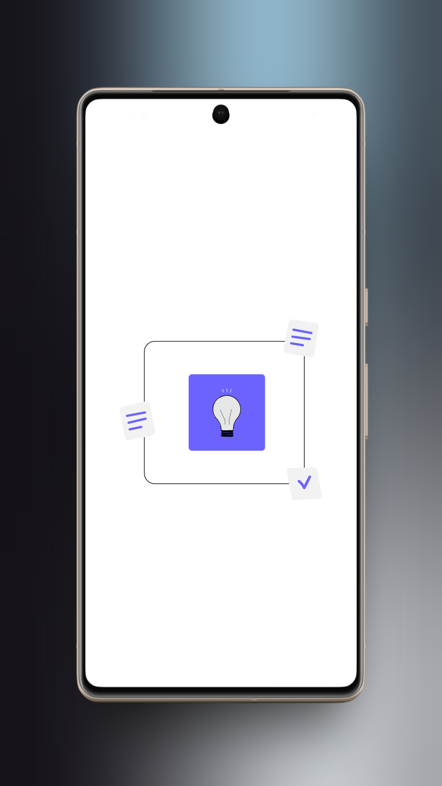
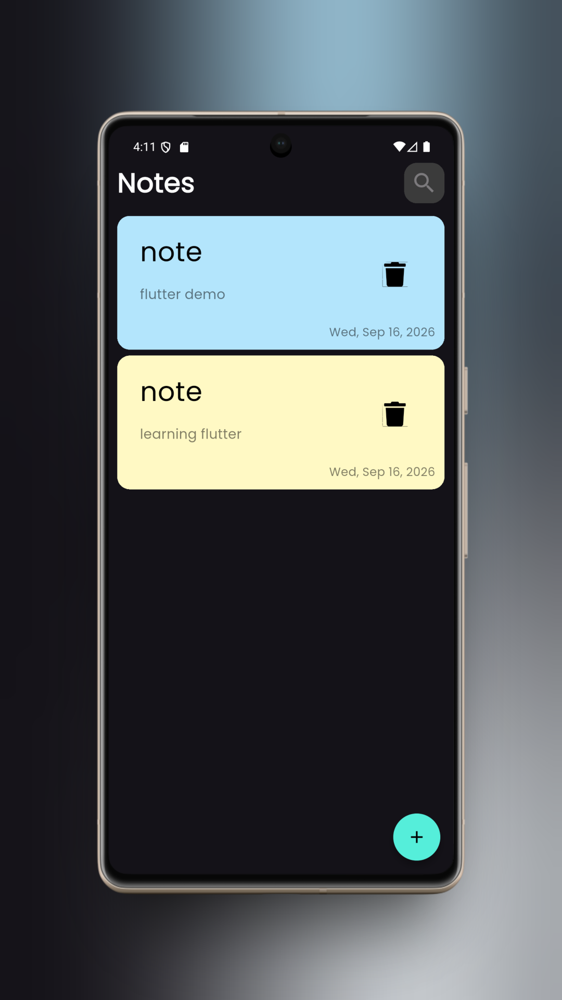
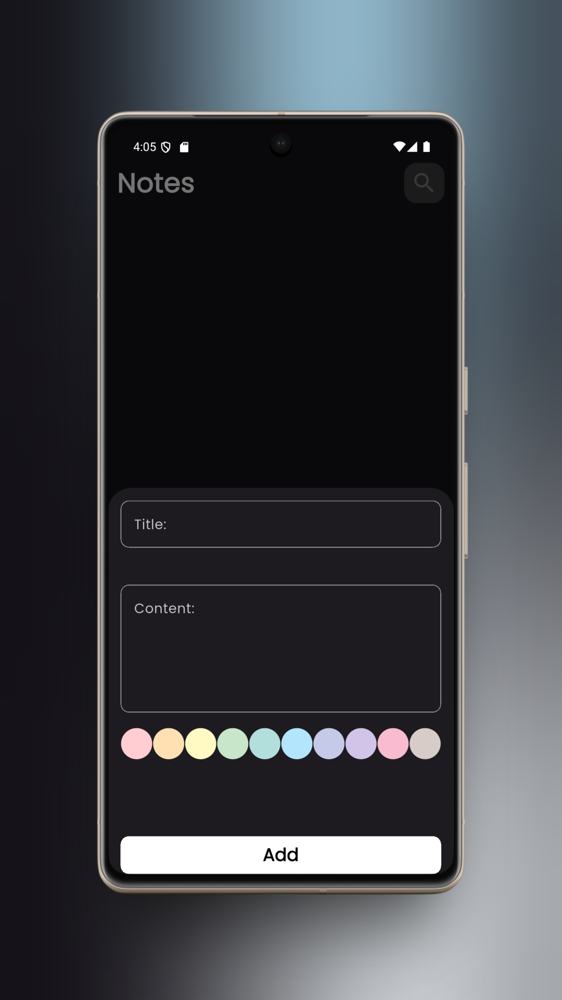
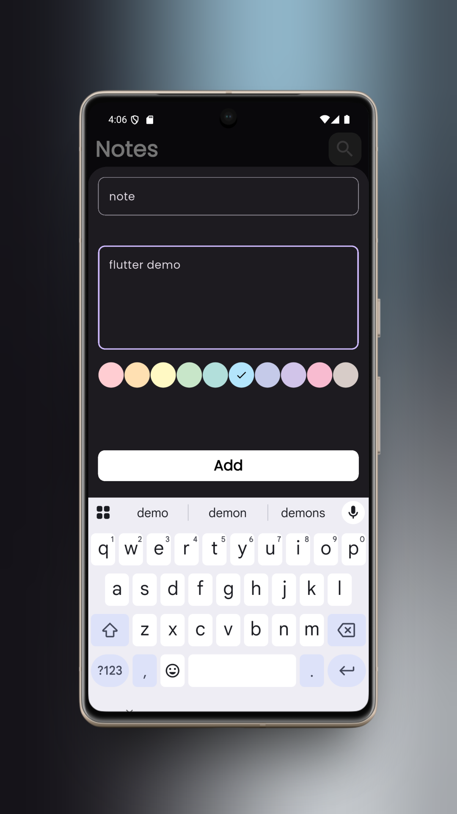
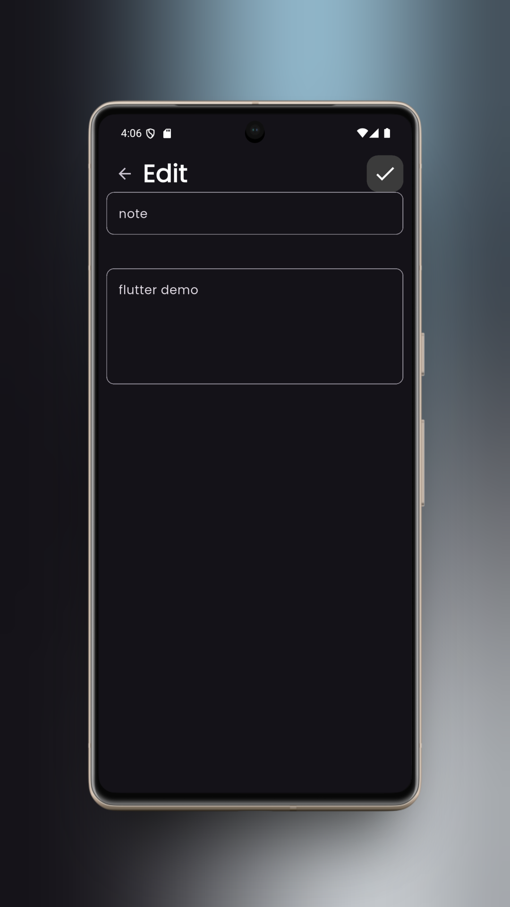
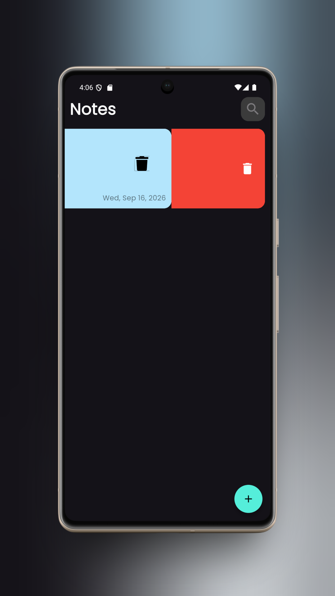

# 📝 Notes App

A modern and simple Flutter Notes application built with **Flutter**, **Hive**, and **Cubit**.

The app allows users to create, edit, delete, and manage their notes locally with a clean and responsive interface.

---

## 📱 Screenshots

<p align="center">
  
  
  
</p>

<p align="center">
  
  
  
</p>

---

## ✨ Features

- ➕ Add new notes
- ✏️ Edit existing notes
- 🗑️ Delete notes
- 💾 Local data persistence using Hive
- 🎨 Color-based note cards
- 📱 Clean and responsive UI
- ⚡ State management using Cubit
- 🔄 Loading, success, and failure states
- 🧩 Organized and maintainable project structure

---

## 🛠️ Technologies & Packages

| Technology | Usage |
|---|---|
| **Flutter** | UI & Application Development |
| **Dart** | Programming Language |
| **Hive** | Local Database |
| **Flutter Bloc / Cubit** | State Management |
| **Material Design** | UI Components |
| **Git & GitHub** | Version Control |

---

## 🏗️ Project Structure

```text
lib/
│
├── cubits/
│   ├── add_note_cubit/
│   │   ├── add_note_cubit.dart
│   │   └── add_note_state.dart
│   │
│   ├── edit_note_cubit/
│   │   ├── edit_note_cubit.dart
│   │   └── edit_note_state.dart
│   │
│   └── read_notes_cubit/
│       ├── read_notes_cubit.dart
│       └── read_notes_state.dart
│
├── models/
│   ├── note_model.dart
│   └── note_model.g.dart
│
├── views/
│   ├── edit_note_view.dart
│   └── notes_view.dart
│
├── widgets/
│   ├── add_new_note.dart
│   ├── add_note_form.dart
│   ├── custom_app_bar.dart
│   ├── edit_note_body.dart
│   ├── note_item.dart
│   ├── notes_list_view.dart
│   └── notes_view_body.dart
│
├── consts.dart
├── main.dart
└── simple_bloc_observer.dart